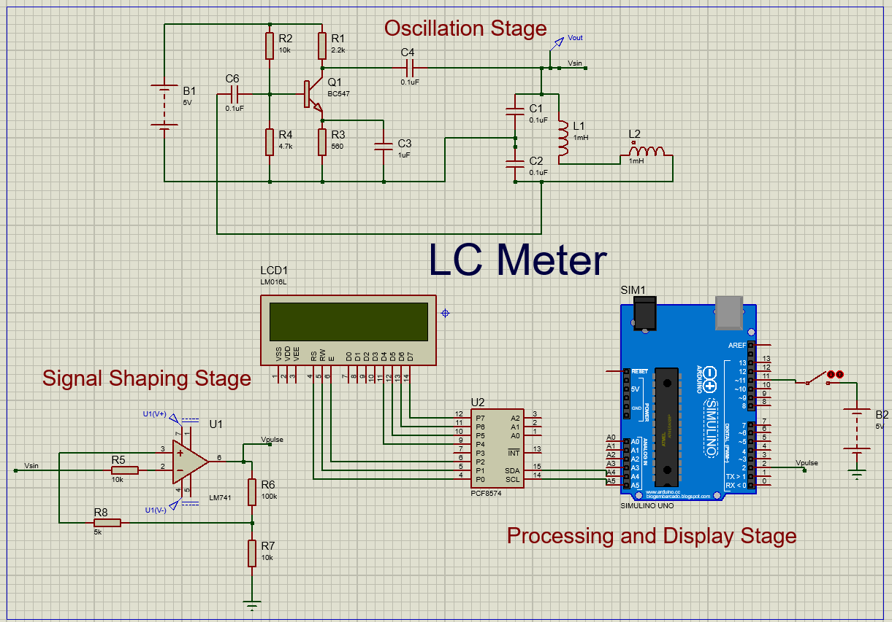

# LC Meter using Arduino

## Professor's Name: Dr. Tarakanath Kobaku  
**Course:** Measurements and Instrumentation (EE2102)  
**Department:** Electrical Dept - ECE  
**Students:** Paavan Sankerth (2301EC19), Priyanshu Gupta (2301EC20), Puneeth Reddy (2301EC21), Rajith Kumar (2301EC22)

---

## Abstract
This project presents the design and implementation of an LC meter based on Neil Hecht's resonance-based measurement technique. The LC meter utilizes a Colpitts oscillator to generate a sine wave whose frequency depends on the inductance (L) and capacitance (C) of the resonant circuit. A comparator converts the sine wave into a square wave, which is processed by an Arduino microcontroller to calculate the frequency with high precision. The relationship:  

\[ f = \frac{1}{2\pi \sqrt{LC}} \]

is used to determine the unknown inductance or capacitance. The measured values are displayed on an LCD, providing a user-friendly interface.

---

## 1. Introduction

### 1.1 Project Background
LC meters are essential tools in measurement and instrumentation for testing inductance and capacitance values in components. Accurate measurement is critical in ensuring proper circuit functionality, as L and C directly impact signal behavior and power management.

### 1.2 Objective
To design and implement an LC meter using a Colpitts oscillator, a comparator, and an Arduino microcontroller, providing precise frequency measurements displayed on an LCD.

### 1.3 Scope of the Project
The project covers the design and simulation of an LC meter using Proteus, focusing on measuring inductance and capacitance, with reliable readings shown on an LCD.

---

## 2. Theory and Working Principle

### 2.1 LC Meter Overview
An LC meter measures inductance and capacitance using the resonance principle:

\[ f = \frac{1}{2\pi \sqrt{LC}} \]

By measuring the resonant frequency, the LC meter can calculate the unknown value of L or C.

### 2.2 Oscillation Stage
**Components:**
- Transistor (BC547)
- Capacitors (C1, C2, C3)
- Inductor (L1)

**Operation:**
1. Transistor amplifies the input signal.
2. Positive feedback through capacitors sustains oscillations.
3. Frequency of oscillation depends on L and C values.

### 2.3 Signal Shaping Stage
**Components:**
- Operational Amplifier (LM741)
- Resistors (R5, R6, R7, R8)

**Operation:**
1. Converts the sinusoidal waveform into a square wave.
2. Easier for the Arduino to process.

### 2.4 Processing and Display Stage
**Arduino Microcontroller:**
1. Measures the frequency of the square wave.
2. Calculates the unknown inductance or capacitance.
3. Displays the value on the LCD.

---

## 3. Circuit Design and Simulation

### 3.1 Components Used
| Component | Specification |
|-----------|----------------|
| Transistor | BC547 |
| Resistors | 10kΩ, 2.2kΩ, 4.7kΩ, 560Ω, 2kΩ, 100kΩ |
| Capacitors | 100nF, 1uF, multiple for measurement |
| Inductor | 1mH, multiple for measurement |
| Op-Amp | LM741 |
| Microcontroller | Arduino Uno |
| Display | 16x2 LCD |
| I2C Expander | PCF8574 |
| Power Supply | 5V DC |

---
  
## 4. Testing and Results

### 4.1 Testing Procedure
- **Simulation:** The circuit was simulated in Proteus to verify signal integrity, timing, and component values.
- **Waveform Analysis:** Verified correct amplitude, frequency, and phase relationships.

### 4.2 Results
| Component | Frequency (kHz) | Actual Value | Measured Value | Error (%) |
|-----------|-----------------|--------------|----------------|-----------|
| Capacitor | 16.6 | 1uF | 1.07uF | 7.0% |
| Capacitor | 15.93 | 2uF | 1.95uF | 2.5% |
| Capacitor | 20.83 | 200nF | 235nF | 17.5% |
| Inductor  | 15.5  | 1mH | 1.09mH | 9.0% |
| Inductor  | 9.43  | 5mH | 4.45mH | 11.0% |
| Inductor  | 21.39 | 0.1mH | 0.077mH | 23.0% |

---

## 6. To-Do / Future Improvements
- Identify and fix the missing connection between the Arduino and the circuit.
- Improve accuracy by refining the frequency measurement process.
- Implement an automated calibration method for better precision.
- Enhance the PCB design for better stability and ease of assembly.
- Develop a user-friendly interface with enhanced display features.
- **Include circuit diagram for reference:**

---

## 6. References
1. Hecht, N. (1979). *A simple and accurate LC meter.* Electronics Today International, 8(10), 48-51.
2. Online resources on electronics, microcontroller programming, and circuit simulation.

---

## PDF Link
([View Original PDF](https://github.com/puneethreddy592/LC-meter/blob/3abda31cb7ff0e77441874aacc601e771d690b4a/LC%20Meter.pdf))

## License

This project is open-source and available under the MIT License.
